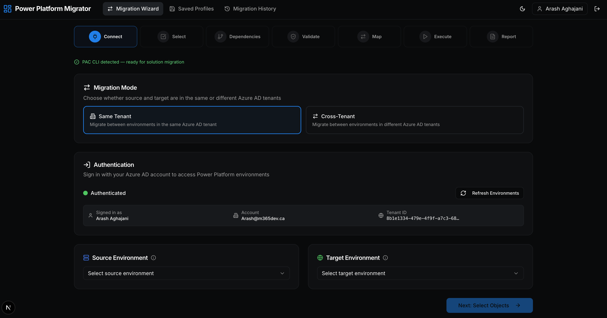
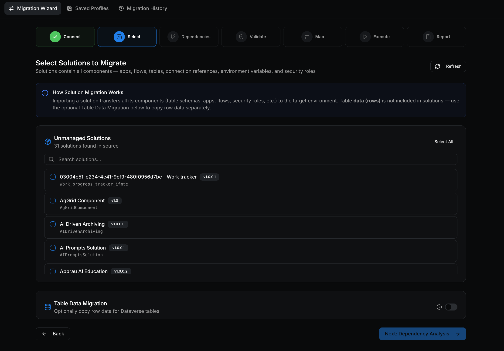
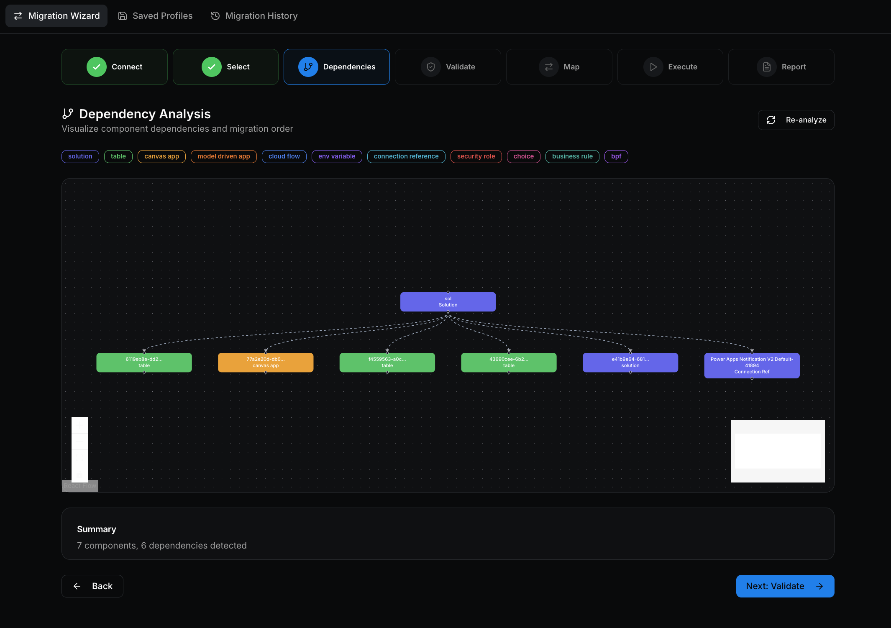
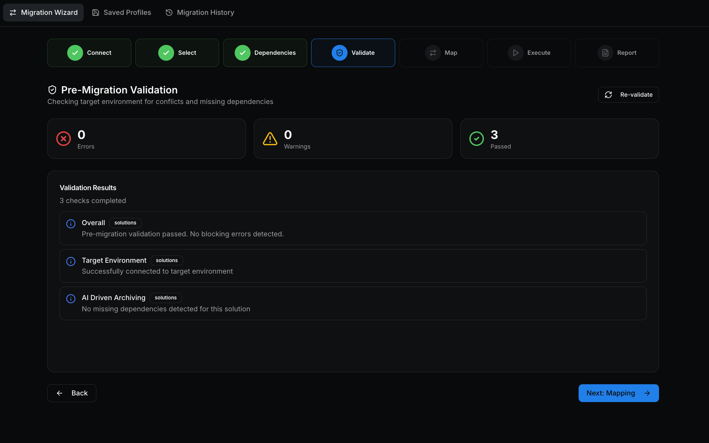
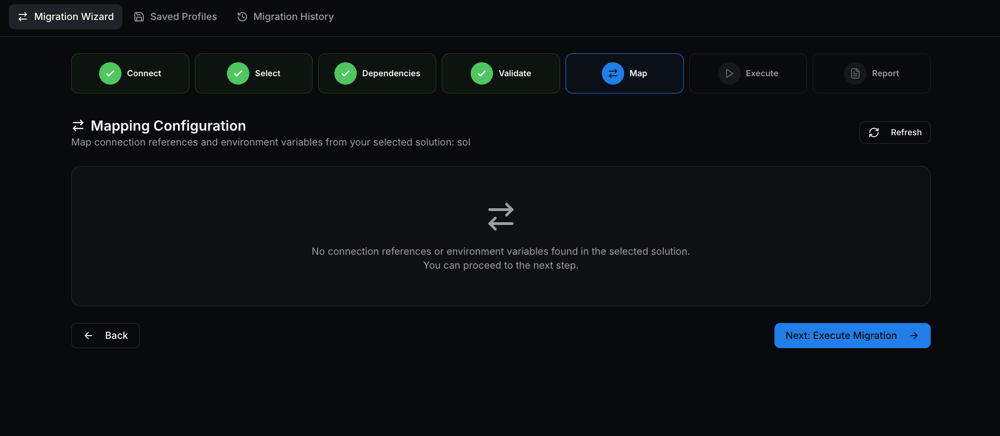
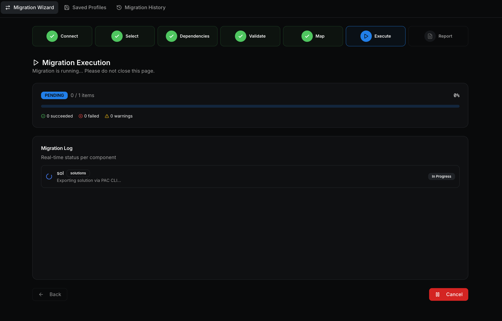
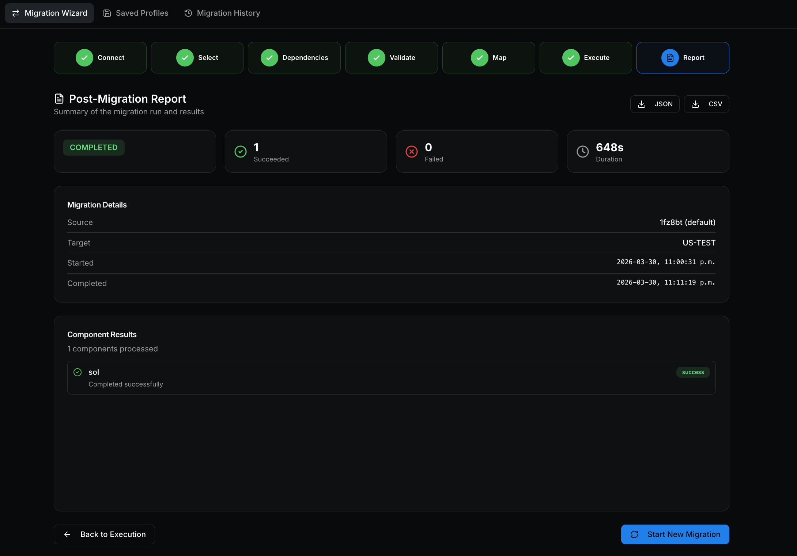

# Power Platform Migrator

A web application for migrating Microsoft Power Platform solutions between environments — including **cross-tenant** migrations. Built with Next.js 15, React 19, TypeScript, and Tailwind CSS v4.

Automate the export/import of Power Platform solutions, Dataverse table data, connection references, environment variables, and more through a guided 7-step wizard.

> **🤖 This web application was fully built using [GitHub Copilot Pro](https://github.com/features/copilot)**

## Features

- **7-Step Migration Wizard** — Connect → Select → Dependencies → Validate → Map → Execute → Report
- **Same-Tenant & Cross-Tenant Migration** — Migrate between environments in the same tenant, or across entirely different Azure AD tenants
- **Solution Migration** — Export and import managed/unmanaged solutions via PAC CLI or Dataverse Web API
- **Dataverse Table Data Migration** — Row-level export/import with automatic lookup GUID remapping, batch processing, and conflict resolution (skip/upsert/overwrite)
- **Dependency Visualization** — Interactive dependency graph powered by React Flow with auto-layout
- **Pre-Migration Validation** — Connectivity checks, version conflict detection, missing dependency analysis
- **Connection & Environment Variable Mapping** — Side-by-side mapping UI before migration
- **PAC CLI Integration** — Automatic detection and optional auto-installation of Microsoft Power Platform CLI
- **Migration Profiles** — Save and reuse migration configurations
- **Activity History** — Full run log with per-component status tracking
- **Dark / Light Mode** — System-aware theme with manual toggle
- **OAuth 2.0 Authentication** — Azure AD via MSAL.js v5 (redirect + popup flows)

## Prerequisites

- **Node.js 18+** (tested with Node.js 22.x)
- **Azure AD App Registration** (see setup below)
- Source and target Power Platform environments with **Dataverse provisioned**
- **.NET SDK 8.0+** (optional — required only for PAC CLI auto-installation)

## Azure AD App Registration Setup

1. Go to [Azure Portal](https://portal.azure.com) → **Microsoft Entra ID** → **App registrations** → **New registration**

2. Configure the registration:
   - **Name**: Power Platform Migrator (or any name)
   - **Supported account types**: Select **"Accounts in any organizational directory (Any Microsoft Entra ID tenant — Multitenant)"**  
     *(Required for cross-tenant migration. If you only need same-tenant, "Single tenant" works too)*
   - **Redirect URI**: Select **"Single-page application (SPA)"** and enter `http://localhost:3000`

3. After creation, go to **Authentication** and add a second SPA redirect URI:
   ```
   http://localhost:3000/popup-redirect.html
   ```
   > Both URIs must be under the **Single-page application** platform (not Web). The second URI is used for the cross-tenant popup login.

4. Go to **API permissions** → **Add a permission** and add:

   | API | Permission | Type |
   |-----|-----------|------|
   | Dynamics CRM | `user_impersonation` | Delegated |
   | Microsoft Graph | `openid` | Delegated |
   | Microsoft Graph | `profile` | Delegated |
   | Microsoft Graph | `offline_access` | Delegated |

5. Click **Grant admin consent** for your organization (or individual users will be prompted on first login)

6. Copy the **Application (client) ID** and **Directory (tenant) ID** from the **Overview** page

## Getting Started

```bash
# Clone the repository
git clone https://github.com/ArashAghajani/powerplatform-migrator.git
cd powerplatform-migrator

# Install dependencies
npm install

# Configure environment variables
cp .env.local.example .env.local
```

Edit `.env.local` with your Azure AD values:

```env
NEXT_PUBLIC_AZURE_CLIENT_ID=your-client-id-here
NEXT_PUBLIC_AZURE_TENANT_ID=your-tenant-id-here
NEXT_PUBLIC_REDIRECT_URI=http://localhost:3000
```

Start the development server:

```bash
npm run dev
```

Open [http://localhost:3000](http://localhost:3000) in your browser.

## Migration Modes

### Same-Tenant Migration

Migrate solutions between two environments in the same Azure AD tenant. Sign in once and select your source and target environments from the dropdown.

### Cross-Tenant Migration

Migrate solutions between environments in **different** Azure AD tenants:

1. Select **Cross-Tenant** mode in the Connect step
2. Sign in to the **Source Tenant** using the standard login
3. Sign in to the **Target Tenant** via the popup — the account picker will appear so you can enter different credentials
4. Select source and target environments from their respective tenant
5. Proceed through the wizard as normal

> **Note**: Your Azure AD app registration must be configured as **Multitenant** for cross-tenant migrations to work.

## PAC CLI (Optional)

The app can use the [Microsoft Power Platform CLI (PAC)](https://learn.microsoft.com/en-us/power-platform/developer/cli/introduction) for solution export/import, which handles large solutions and web resources better than the Dataverse Web API.

- If PAC CLI is detected on your system, it will be used automatically
- If not detected, a banner on the Connect step offers **one-click installation** (requires .NET SDK 8.0+)
- If PAC CLI is unavailable or auth fails, the app falls back to the Dataverse Web API — no functionality is lost

### PAC CLI Authentication

After installing PAC CLI, you need to create auth profiles for each environment you want to migrate. Use the **device code** flow — it works reliably from any terminal:

```bash
# Authenticate to your source environment
pac auth create --url https://your-source-org.crm.dynamics.com --deviceCode

# Authenticate to your target environment
pac auth create --url https://your-target-org.crm.dynamics.com --deviceCode
```

Each command will display a URL and a code. Open the URL in your browser, enter the code, and sign in. You can verify your profiles with:

```bash
pac auth list
```

## How It Works

### Step 1 — Connect
Choose migration mode (same-tenant or cross-tenant), authenticate, and select source/target environments.



### Step 2 — Select
Browse and select solutions to migrate. Optionally select Dataverse tables for row-level data migration.



### Step 3 — Dependencies
View an interactive dependency graph of your selected solutions and their components. Identify missing dependencies in the target environment.



### Step 4 — Validate
Run pre-migration checks: connectivity, version conflicts, missing references, and schema compatibility.



### Step 5 — Map
Map connection references and environment variables from source to target values.



### Step 6 — Execute
Run the migration. Solutions are exported from source and imported to target. Table data is migrated row-by-row with progress tracking. Failed components are automatically skipped so the migration continues.



### Step 7 — Report
View detailed results per component with success/failure/warning status and error messages.



## Project Structure

```
src/
├── app/                          # Next.js App Router
│   ├── page.tsx                  # Home — Migration Wizard
│   ├── history/page.tsx          # Migration History
│   ├── profiles/page.tsx         # Saved Profiles
│   ├── layout.tsx                # Root layout
│   ├── providers.tsx             # Client-side providers
│   └── api/pac/                  # API routes for PAC CLI
│       ├── auth/route.ts         # PAC CLI auth management
│       ├── export/route.ts       # Solution export
│       ├── import/route.ts       # Solution import
│       ├── install/route.ts      # PAC CLI detection & installation
│       ├── settings/route.ts     # Dataverse org settings
│       └── migrate-table-schema/ # Table schema migration
├── components/
│   ├── ui/                       # shadcn/ui components
│   ├── layout/                   # App shell & navigation
│   └── wizard/
│       ├── migration-wizard.tsx  # Wizard container & step routing
│       └── steps/                # Individual wizard steps
│           ├── step-connect.tsx
│           ├── step-select.tsx
│           ├── step-dependencies.tsx
│           ├── step-validation.tsx
│           ├── step-mapping.tsx
│           ├── step-execution.tsx
│           └── step-report.tsx
└── lib/
    ├── api/
    │   ├── api-utils.ts          # fetchWithRetry, error handling
    │   ├── power-platform.ts     # Dataverse & Power Platform APIs
    │   ├── dataverse-migration.ts # Row-level data migration engine
    │   └── pac-cli.ts            # PAC CLI client functions
    ├── auth/
    │   ├── msal-config.ts        # MSAL configuration & scopes
    │   └── auth-context.tsx      # React auth context provider
    ├── stores.ts                 # Zustand state stores
    ├── types.ts                  # TypeScript type definitions
    └── utils.ts                  # Utilities
```

## Tech Stack

| Category | Technology |
|----------|-----------|
| Framework | Next.js 15 (App Router, Turbopack) |
| Language | TypeScript 5.8 |
| UI | React 19 |
| Styling | Tailwind CSS v4 |
| Components | shadcn/ui + Radix UI |
| State Management | Zustand 5 |
| Authentication | MSAL.js v5 (Azure AD OAuth 2.0) |
| Dependency Graph | React Flow + dagre |
| Icons | Lucide React |
| Theming | next-themes |

## Scripts

```bash
npm run dev      # Start dev server (Turbopack)
npm run build    # Production build
npm run start    # Start production server
npm run lint     # Run ESLint
```

## Troubleshooting

### "Cross-origin token redemption" error
Both redirect URIs (`http://localhost:3000` and `http://localhost:3000/popup-redirect.html`) must be registered under the **Single-page application** platform in Azure AD — not the "Web" platform.

### "Application not found in directory" error during cross-tenant login
Your app registration's **Supported account types** must be set to **Multitenant** ("Accounts in any organizational directory").

### PAC CLI not detected
Ensure `pac` is in your system PATH. If you installed via `dotnet tool install --global`, you may need to add `~/.dotnet/tools` to your PATH and restart your terminal.

### Token acquisition failures
Clear your browser's localStorage and cookies for `localhost:3000`, then sign in again.

## Feedback

This project is **not accepting pull requests** at this time. However, your feedback is highly valued! If you find a bug, have a feature request, or want to share your experience, please [open an issue](https://github.com/ArashAghajani/powerplatform-migrator/issues).

## Disclaimer

This application is provided **as-is** for educational and testing purposes only. It is not intended for production use without thorough validation in your own environment. The authors accept no responsibility for any data loss, corruption, or unintended changes resulting from the use of this tool. Always test migrations in a **sandbox or developer environment** before applying them to production, and ensure you have proper backups in place.

## License

MIT
